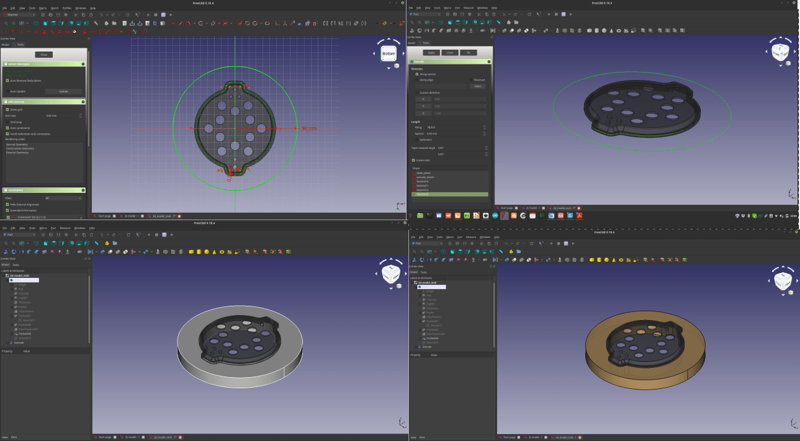

<!-- Copy this template to add a new topic. Replace text in {brackets} with your content. -->
<!-- Template created for ECO_NIME wiki entries by Johnny Sullivan -->

# Open Source CAD Software for TUIs Development

<!-- replace 'Template' with short title; this will be page title when published -->

## Summary of Issue

In many of the pages presented on the ECO NIME WIKI, we stress the fact that is advisable to use open source CAD software to develop DMIs. In the following paragraphs we will focus specifically on this particular sustainable strategy.

Computer-Aided Design (CAD) software is a powerful tool that can aid the NIME community in the development of projects, as it enables the creation of digital models of physical objects. However, **much of the CAD software available today is proprietary and can be costly, limiting accessibility and potentially leading to obsolescence** if the owning company decides to discontinue support.

Fortunately, open-source CAD software offers a valid alternative that can help the NIME community develop projects in a more sustainable way. **Open-source software is built by a community of developers who share their code freely, allowing users to access and modify it as needed**. This approach not only makes software more accessible but also promotes collaboration and innovation within the community.

In this chapter of the wiki, **we will describe some open-source CAD software that can be used by the NIME community in their projects**. 

By utilizing open-source CAD software, the NIME community can develop their projects in a more sustainable, accessible, and collaborative manner.

## Questions Raised

1. Is the software available for a wide number of people?
2. Does the software I’m using risk being dismissed any soon? 
3. How difficult for me or other members of the community will be to work with my files in the future?

## Information and recommendations (TL;DR)

1. Try to use the following software

- **3D Modeling**
 - Freecad (Part and Part Design Workbenches)
 - OpenScad 
 - Blender

- **2D Vector Graphics**

 - Inkscape 
 - LibreCAD  
 - FreeCAD (Draft and Sketcher Workbenches)

- **PCB Design**

 - KiCAD 

2. Document your project and provide source files 

----

## Notes

A unique recommendation to answer the questions above is the following: **Use open source software to develop your projects and provide the community with the source files you developed** so, here is a list of specific software that can be used in TUI development, and the means to .

### Open Source CAD

**FreeCAD** [[1]] is a free and open-source 3D CAD software that allows users to create and edit parametric 3D models with a comprehensive set of tools and a user-friendly interface. - here, you can find a series of tutorials to get familiar with this software [[2]]

**OpenSCAD** [[3]] is a free and open-source script-based 3D CAD software that allows users to create and modify complex solid objects using a programming language. - here, you can find a series of tutorials to get familiar with this software [[4]]

**Blender** [[5]] is a free and open-source 3D creation software that allows users to create and animate 3D models, scenes, and visual effects for films, video 
games, and other media. - here, you can find a series of tutorials to get familiar with this software [[6]]

**Inkscape** [[7]] is a free and open-source vector graphics editor software that allows users to create and edit scalable vector graphics (SVG) and other graphics formats for illustrations, logos, and other graphic design projects. - here, you can find a series of tutorials to get familiar with this software [[8]]

**LibreCAD** [[9]] is a free and open-source 2D CAD software that allows users to create and edit technical drawings, schematics, and diagrams for architectural, mechanical, and engineering projects. - here, you can find a series of tutorials to get familiar with this software [[10]]

**KiCAD** [[11]] is a free and open-source software suite used for electronic design automation (EDA) that allows users to design printed circuit boards (PCBs), schematics, and electrical diagrams for electronic projects. - here, you can find a series of tutorials to get familiar with this software [[12]]

It is also worth mentioning that the software above can all interact with each other, and offer very interesting possibilities, for example, a FreeCAD addon named **KiCAD StepUp** [[13]] can be used to draw very easily the border of your cisrcuit so that it perfectly fits with the casing designed in **FreeCAD** [[14]]

### Documentation

It is advisable to share the source files of your project in a repository and, if you want to be really extreme, you can include there the version of the software you are using (since is opens source that's completely legal).
On top of that, **Inkscape** can be a very powerful instrument to produce very accurate documentation. 

## External Links and References

[[1]] https://www.freecad.org/
[[2]] https://www.youtube.com/playlist?list=PLWuyJLVUNtc0UszswD0oD5q4VeWTrK7JC
[[3]] https://openscad.org/
[[4]] https://www.youtube.com/watch?v=dx06_gcdMck&list=PL3by7evD3F51u-17hoepe7IduGkfp2Fu6
[[5]] https://www.blender.org/ 
[[6]] https://www.youtube.com/watch?v=6FaLHFJ2kKI&list=PL3GeP3YLZn5ixsnIOIx9tB4v6s-rsw48X  
[[7]] https://inkscape.org/
[[8]] https://www.youtube.com/watch?v=XFFZXgBtNlg&list=PLynG8gQD-n8AB8eeoRuae-Pm0koebv9iC
[[9]] https://librecad.org/
[[10]] https://www.youtube.com/playlist?list=PLh1Mh_dB_MNHxafvJwpw86QvHT0KWsb5s
[[11]] https://www.kicad.org/
[[12]] https://www.youtube.com/watch?v=vaCVh2SAZY4&list=PL3bNyZYHcRSUhUXUt51W6nKvxx2ORvUQB 
[[13]] https://www.kicad.org/external-tools/stepup/ 
[[14]] https://www.youtube.com/watch?v=JFpKwWf0n68 

## Contributor

* [Nicolò Nerendino (aka "Chi ha ucciso Il Conte?")](https://chihauccisoilconte.eu/)

