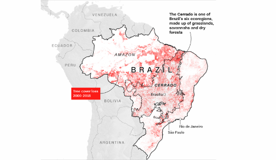
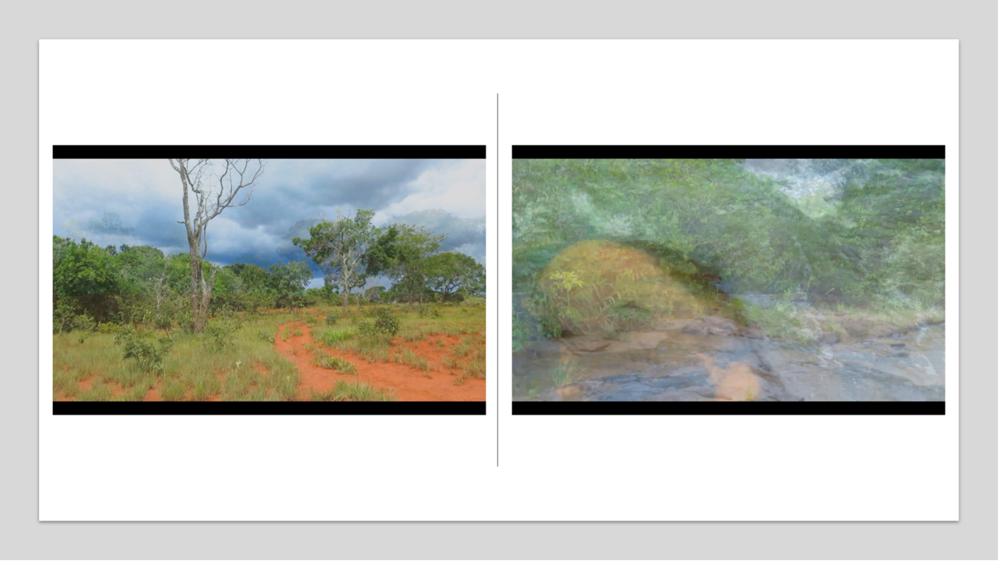

# Merging ambient and experimental music with the Brazilian Cerrado

***[Anésio Neto](https://linktr.ee/stellatum_)***

## Brazilian ecosystem complexity 

Brazil is the fifth largest country in the world, covering approximately 8,515,767 km2. As a country with rich and varied ecosystems, its fauna and flora are among the most diverse in the world. Recently, the Amazon rainforest was in the international media spotlight, which reported how ranchers/landowners in the state of Pará set a series of fires in support of the anti-environmental policies of the president of Brazil, Jair Bolsonaro. 

While much has been said about the Amazon, little has been reported in the international media about other Brazilian ecosystems that have been under similar attacks. Brazil is composed of six ecoregions or, according to the definition of the Brazilian geographer Aziz Ab’saber (1977), morphoclimatic zones. This name is more appropriate, as it takes into account not only the taxonomic characteristics of species that make up the fauna and flora of a region, but also characteristics of orography, climate, soil, and vegetation to define the different reqions of Brazil. In addition to the Amazon equatorial zone where the Amazon rainforest is located, the Cerrado, the Atlantic Forest, Caatinga, Araucaria Forests and Prairies compose the vast Brazilian landscape mosaic.

> **Figure 1**: Image source -
https://edition.cnn.com/2019/09/22/americas/brazil-cerrado-soy-intl/index.html

Anthropic action – that is, activity of or relating to humans - is degrading the Cerrado without any balanced planning between “the use of space and the integrated defense of nature” (AB’SABER, 2007 p. 117). Large estates, monocultures and extensive cattle raising are spreading within the territory. Data from 2018[1] indicate that 50% of the Cerrado territory is already deforested. The importance of this morphoclimatic zone cannot be stressed enough, and it is a great risk of shrinking even smaller. The importance of the Cerrado is not only related to its phytogeographic level or in the great diversity of its fauna, but also to the process of formation of the main Brazilian hydrographic basins (BARBOSA, 2014). It is, therefore, a morphoclimatic zone or biogecographic system whose landscape has defining elements that are involved in intricate interdynamic relationships, especially with regard to its climatic and pedological conditions [relating to the study of the soil]. 

## Audiovisual experimentation and the creation of augmented environments 

“Stellatum” (In Latin) can mean “starred” or “that shone”, and also appears in the Latin name of a native but not endemic grass of the Brazilian Cerrado, the Paspalum stellatum The term is also in the nomination to Julius Schiller's text, Coelum Stellatum Christianum. In this book the author proposes the replacement of constellations of pagan figures with elements of primitive Christianity and the Bible. 

stellatum_ is also the name of the audiovisual performance project that emerges from my artistic investigations from materials obtained from my spatio-temporal experiences in the Brazilian Cerrado. With the choice of name, the intention was to associate all artistic production to the practices and reflections that flow from the contextual appropriation of the Cerrado. 

In my artistic work, I use audiovisual recordings made in the Brazilian Cerrado in order to create an environment that can foster the visitor to dive into the complexity of that vast morphoclimatic zone.  The deepening of the natural structure of the Cerrado is built from the remodeling of the first materiality (field recordings). It outlines a very specific poetic methodology, designed in order to foster a condition "of sharing emotions and feelings that produce different meanings and affections in the specific contexts of the lives of the communities of people involved” (OLIVEIRA, 2017, p. 880).

The multimedia installations and audiovisual performances are based on the temporality of the natural world. The creative dynamics between field recordings from Cerrado landscapes (the natural environment) and the space artistically established through the media (the virtual environment) enacts a multiperceptive environment. I call them "augmented environments", as they result from a dialectical process derived from the movement marked by opposing relationship between Nature and artistic management. That implies a dialectic between a fact and what is constituted (material), between the generic environment (natural environment) and the site-specific virtual environment (the environment created as a result of performance and installations). The “augmented environment” would thus be the synthesis of a process of unfolding a third-level space that is not the sum of isolated characteristics, but grouped around the generic environment and the established space. 

All the creation of audiovisual performances and multimedia installations flow from the intention of evoking, and not representing, my spatio-temporal experience in the Cerrado landscapes. More specifically, the building of the performances’ sound blocks is based on the search for the construction of the sound field relative to the landscapes of the Cerrado sites. Acoustic or Bioacoustic Ecology Knowledge appears as a way to understand certain occurrences in the auditory environment and guide the notions of movement, positioning and interactivity of sound sources. 

## Primavera

“Primavera”[^1] was composed based on the dynamics of biophony in the rainy seasons of the Brazilian Cerrado[^2]. The low and high frequency drones (repeated sounds) overlap with the sound of the natural symphony and are intended as guides for the ears. Temporality is correlated to the duration of sound manifestations – time is established as a flow, being observed from within a process.

> **Figure 2**: Cover for the album _Projeto: Cerrado - Primavera & Verão_, 2020. Graphic art: Havane Melo, 2020.

In “Primavera” I tried to present the first rains that appear at the end of the dry season (autumn and winter). Due to these rains, there is an escalation in the amount of sound sources expressed in the massive presence of frogs and cicada singing [cicadas]. Such rains consequently generate an increase in humidity. With changing weather patterns, consequently, there will be a change in the way animals vocalize. Furthermore, reverberation is a phenomenon related to the way in which sound waves are reflected on spatial surfaces of a given environment, defining the identity of a particular sound. Therefore the phenomenon of reverberation directly influences the way we can perceive sound derived from animal vocalization. In this sense, climate dynamics are influential factors in the way we perceive sound occurrences in a given environment (LAROM et al., 1997, p. 421-431). For this reason, reverberation, as an effect of space on a given sound, is a sound parameter over which we seek knowledge and control. 

The videos that make up the audiovisual performances of “Primavera”[^3] rely on the basic perceptual elements of the experience in Cerrado sites. Here, the entire visual block included in the poetic perspective is anchored to the situated experience and in the imagery developed during my hikes. Such perspective can be considered a derivative of influential sound artists in the ambient music scene of the 1990s and 2000, such as loscil and Biosphere. Both make use of sound and visual recordings derived from their experiences in natural landscape.

> **Figure 3**: Video excerpts from a performance of _Projeto: Cerrado – Primavera_, 2020.

Since the end of my doctoral research, I have been looking for ways to expand the ability to extract acoustic patterns from the soundscapes of the Cerrado, Amazon and Atlantic Forest in order to generate other ways of perceiving the complexity involved in these ecosystems. So far, along with other researchers and artists, we have been trying to apply AI and supervised learning to find ways to visualize assumed patterns and sonify them.

---

## More information about Cerrado:

- *Global hunger for soybeans 'destroying Brazil's Cerrado savanna* - [BBC article](https://www.bbc.com/news/av/world-46033689)
- *The Amazon burns. But another part of Brazil is being destroyed faster* - [CNN article](https://edition.cnn.com/2019/09/22/americas/brazil-cerrado-soy-intl/index.html)

---

[^1]: Listen to the piece on [Spotify](https://open.spotify.com/track/2M002kC9TnarIMPMhNCoS8?si=30901842068e4ebf).  
[^2]: The Cerrado biome is predominantly constituted by the seasonal tropical climate, characterized dry autumns and winters, and rainy springs and summers.  
[^3]: Watch the video on [Vimeo](https://vimeo.com/477135283).