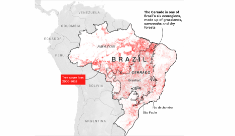
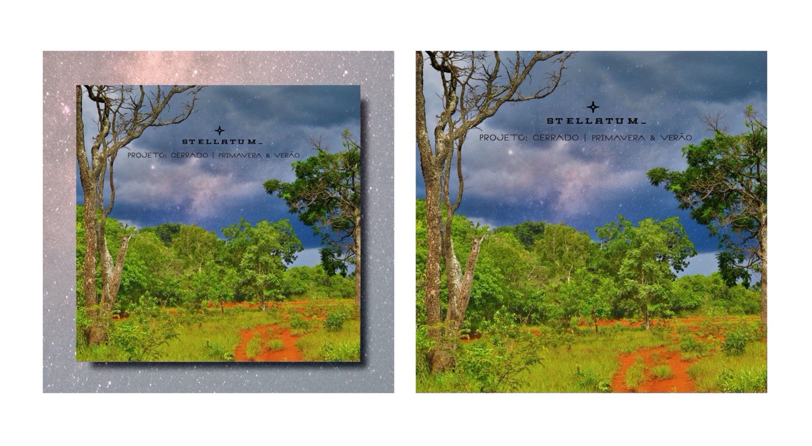
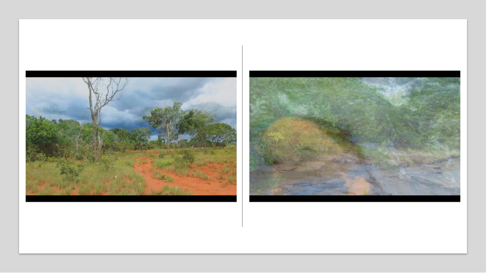

# O encontro da música ambiente e experimental com o Cerrado Brasileiro

Por ***[Anésio Neto](https://linktr.ee/stellatum_)***

## A complexidade ecossistêmica do Brasil 

O Brasil é o quinto maior país do mundo, possuindo uma extensão territorial de mais ou menos 8.515.767 quilômetros quadrados. Sendo um país de ricos e variados ecossistemas, sua fauna e flora constam entre as mais diversas do mundo. Recentemente, a floresta amazônica esteve sob o holofote dos principais meios de comunicação internacionais, que noticiaram uma série de queimadas induzidas por fazendeiros/latifundiários do estado do Pará em apoio às políticas anti-ambientais do presidente do Brasil, Jair Bolsonaro. 

Enquanto muito foi dito acerca da Amazônia, pouco foi noticiado nos meios de comunicação internacionais sobre outros ecossistemas brasileiros que vêm sofrendo ataques similares. O Brasil é dotado de 6 ecorregiões \[ecoregions\] ou, de acordo com a definição do geógrafo brasileiro Aziz Ab'saber (1977), domínios morfoclimático \[morphoclimatic zone/domain\]. Essa denominação é mais adequada, pois levam em consideração não apenas características taxonômicas de espécies que compõe a fauna e a flora de uma região, como também características de relevo, clima, solo e vegetação para se definir as unidades paisagísticas do Brasil. Além do domínio equatorial amazônico, onde se localiza a floresta amazônica, comporiam o vasto mosaico paisagístico brasileiro o Cerrado, a Mata Atlântica, Caatinga, Florestas de Araucárias e as Pradarias.

> **Figura 1**: Fonte da imagem -
https://edition.cnn.com/2019/09/22/americas/brazil-cerrado-soy-intl/index.html

A ação antrópica vem, forçosamente, reduzindo a extensão territorial do Cerrado sem qualquer planejamento equilibrado entre "o uso do espaço e a defesa integrada da natureza" (AB'SABER, 2007 p. 117). Irrompe em seus veios os latifúndios, a monocultura e a criação de gado extensiva. Dados de 2018^\[1\]^ apontam que 50% de seu território está desflorestado. Caso não haja nenhum tipo de esclarecimento acerca da importância desse domínio morfoclimático, sua área total corre grande risco de ter sua área ainda mais reduzida. A importância do Cerrado não se encontra apenas a nível fitogeográfico ou na grande diversidade de sua fauna, mas, também, no processo de formação das principais bacias hidrográficas brasileiras (BARBOSA, 2014). É, pois, um domínio morfoclimático ou sistema biogeográfico cuja paisagem possui elementos definidores que estão envolvidos em intricadas relações interdinâmicas, especialmente no que tange às suas condições climáticas e pedológicas \[relativas ao estudo do solo\].

## Experimentação audiovisual e a criação dos ambientes expandidos

Do latim, "stellatum" pode significar "estrelou" ou "que brilhou", além de figurar na denominação latina de uma gramínea nativa, mas não endêmica, do Cerrado brasileiro, a *Paspalum stellatum*; o termo também está na nominação ao atlas de Julius Schiller, *Coelum Stellatum Christianum,* no qual é proposta a substituição denominativa de constelações de figuras pagãs por elementos do cristianismo primitivo e da bíblia.

*stellatum\_* também denomina o projeto de performance audiovisual que surge de minhas investigações artísticas a partir de materiais obtidos de minha experiências espaço-temporal no Cerrado brasileiro. Com a escolha do nome, o intuito foi associar toda produção artística às práticas e reflexões que fluem da apropriação contextual do Cerrado.

Em meu trabalho artístico, utilizo-me de gravações audiovisuais feitas no Cerrado brasileiro com o intuito de criar ambiências para se propor um mergulho na complexidade daquele vasto domínio morfoclimático. O aprofundamento na estrutura natural do Cerrado é pretendido a partir da remodelação da materialidade primeira (gravações de campo), a qual delineia, portanto, uma metodologia poética bastante específica, definida a partir de um planejamento na proposição de percepções a coincidir para uma condição "de partilha de emoções e sentimentos que produzem sentidos e afetos diversos nos contextos específicos da vida das comunidades de pessoas envolvidas" (OLIVEIRA, 2017, p. 880).

A dinâmica criativa entre as gravações de campo provenientes das paisagens do Cerrado (o ambiente natural) e o espaço instaurado artisticamente por meio de instalações multimídias e performances audiovisuais, que se baseiam na temporalidade do mundo natural, engendram um ambiente multiperceptivo. Esse ambiente denominei "ambientes expandidos", pois resultam de um processo dialético derivado do movimento balizado pela relação contrária entre Natureza e o manejo artístico, entre um dado e o constituído (material), entre o ambiente genérico (ambiente natural) e o site-specific (o ambiente instaurado em decorrência da performance e das instalações). O "ambiente expandido" seria, dessa feita, a síntese de um processo de desdobramento de um espaço de terceira ordem que não é a soma de características isoladas, agrupadas em torno do ambiente genérico e do espaço instaurado.

Toda a criação das performances audiovisuais e das instalações multimídia fluem do intuito de evocar, e não representar, minha experiência espaço-temporal nas paisagens do Cerrado. Mais especificamente, a construção dos blocos sonoros das performances é baseada na busca pela construção do campo sonoro relativo às paisagens dos sítios do Cerrado. Os conhecimentos provenientes da Ecologia Acústica ou Bioacústica aparecem como forma de entender determinadas ocorrências no entorno auditivo e orientar as noções de movimentação, posicionamento e interatividade das fontes sonoras.

"Primavera"[^1] foi composta tendo por base a dinâmica da biofonia nos períodos de chuva do Cerrado brasileiro[^2], os drones de baixa e alta frequência (sons repetidos) desdobram-se ao som da sinfonia natural e pretendem-se como guias para os ouvidos. A temporalidade é correlata à duração das manifestações sonoras -- o tempo se institui como fluxo, sendo observado por dentro de um processo.

> **Figura 2**: capa para o formato digital do álbum _Projeto: Cerrado - Primavera & Verão_, 2020. Arte gráfica: Havane Melo, 2020.

Em "Primavera" busquei apresentar as primeiras chuvas que despontam ao fim da estação seca (outono e inverno). Por conta dessas chuvas, há um singelo aumento da quantidade de fontes sonoras expressa na presença massiva de cantos de anuros e cigarras \[cicadas\]. Tais chuvas geram, consequentemente, um aumento na umidade. Com a alteração dos padrões climáticos, consequentemente, haverá uma mudança no modo como as espécies animais vocalizam. Além disso, posto que a reverberação seja um fenômeno relacionado ao modo como as ondas sonoras refletem a superfície espacial de determinados ambientes, empregando identidade a um determinado som, tal fenômeno influenciará diretamente no modo como podemos perceber o som derivado da vocalização animal. Nesse sentido, as dinâmicas climáticas acabam por ser fatores influentes no modo de percebermos ocorrências sonoras em um determinado ambiente (LAROM et al., 1997, p. 421-431). Por esse motivo, a reverberação, como efeito do espaço sobre um determinado som, é um parâmetro sonoro sobre o qual buscamos conhecimento e controle.

Os vídeos que compõem as performances audiovisuais de "Primavera"[^3] não prescindem dos elementos perceptivos básicos da experiência nos sítios do Cerrado. Aqui*,* todo o bloco visual incluso na perspectiva poética ancora-se na experiência situada e nas capturas imagéticas realizadas concomitantemente às caminhadas. Tal perspectiva afigura-se como uma possibilidade derivada para com a aproximação de artistas sonoros influentes no cenário da música ambiente dos anos 1990 e 2000, tais como loscil e Biosphere. Ambos se utilizam de gravações sonoras e visuais derivadas de suas experiências com a paisagem.

> **Figura 3**: Imagem que compõe trechos do vídeo da performance _Projeto: Cerrado – Primavera_, 2020.

Desde o término de minhas pesquisas no doutorado, venho buscando meios de ampliar a capacidade de se extrair padrões acústicos da paisagem sonora do Cerrado, Amazônia e Mata Atlântica no intuito de gerar outros modos de se perceber a complexidade envolvida nesses ecossistemas. Até o presente momento, juntamente a outros pesquisadores e artistas, temos tentado aplicar IA e aprendizagem supervisionada para buscar forma de visualizar padrões pressupostos e sonificá-los.

---

Para maiores informações acerca do Cerrado e a devastação perpetuada em solo brasileiro, conferir:

1. *Global hunger for soybeans \'destroying Brazil\'s Cerrado savanna\'* - [BBC article](https://www.bbc.com/news/av/world-46033689)
2. *The Amazon burns. But another part of Brazil is being destroyed faster* - [CNN article](https://edition.cnn.com/2019/09/22/americas/brazil-cerrado-soy-intl/index.html)

---

[^1]: Ouça a composição por meio do link: <https://open.spotify.com/track/2M002kC9TnarIMPMhNCoS8?si=30901842068e4ebf>  
[^2]: O bioma Cerrado é constituído predominantemente pelo clima tropical sazonal, caracterizado por outono e invernos secos e primavera e verões chuvosos.  
[^3]: Link para o vídeo: <https://vimeo.com/477135283>