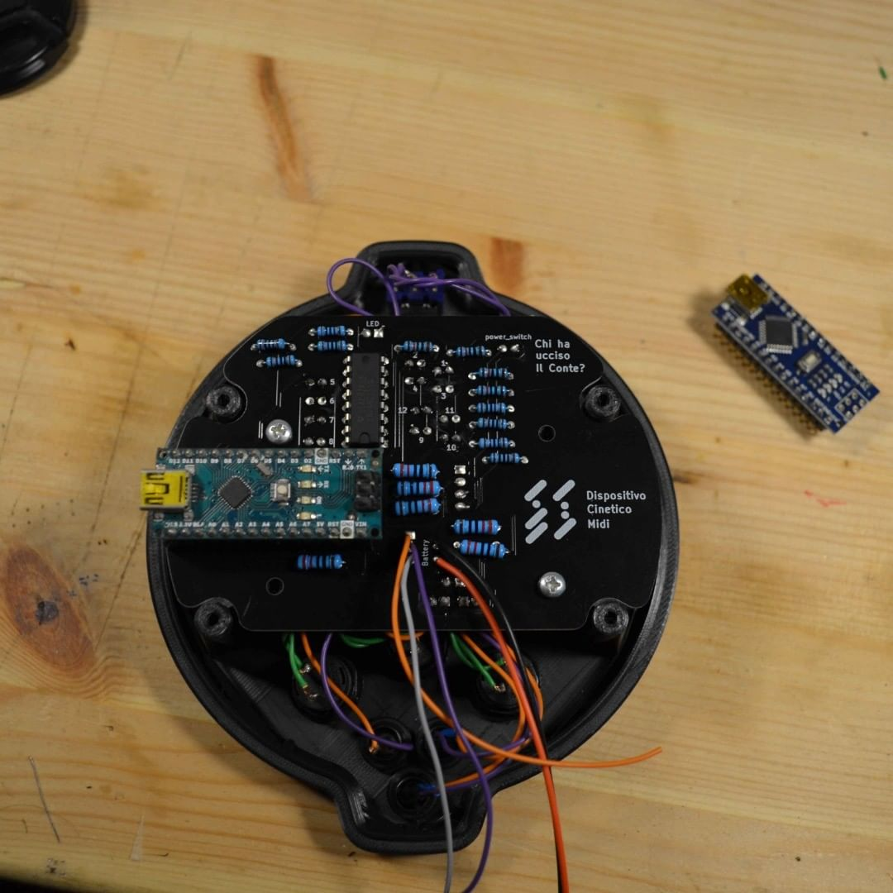
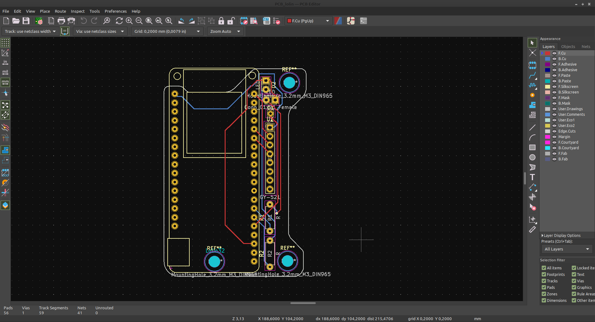
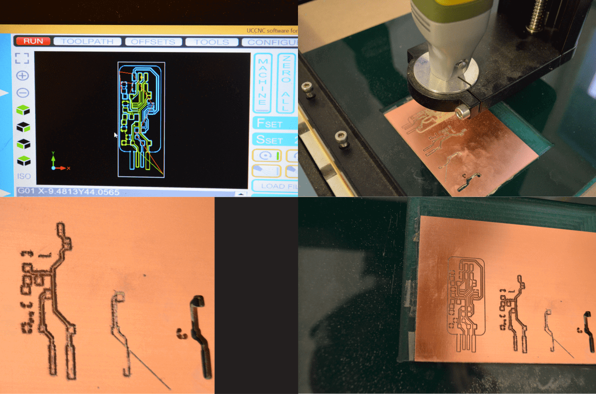
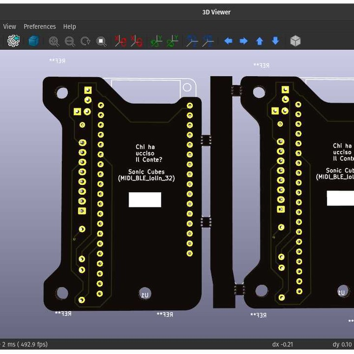
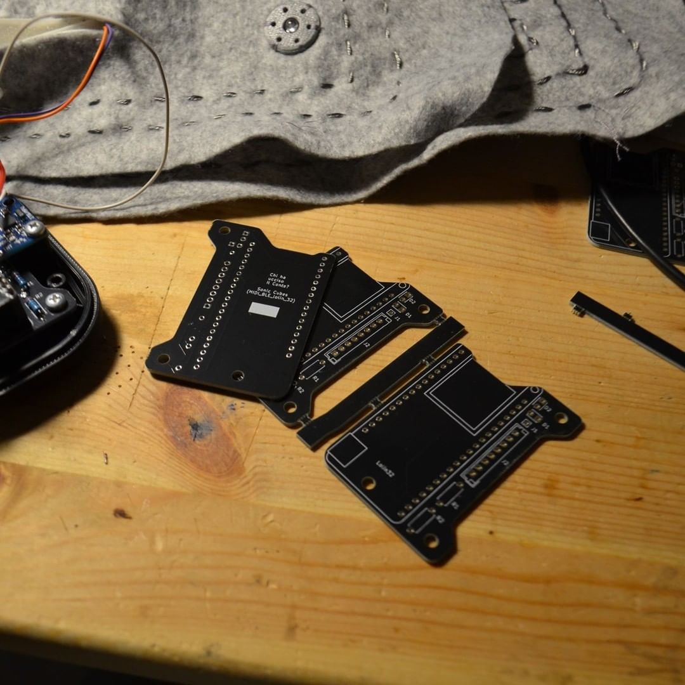

<!-- Copy this template to add a new topic. Replace text in {brackets} with your content. -->
<!-- Template created for ECO_NIME wiki entries by Johnny Sullivan -->

# Circuit Production

<!-- replace 'Template' with short title; this will be page title when published -->

## Summary of Issue

**Circuits design and production can be a crucial aspect of NIME**. In NIME, circuits are used to create custom electronic musical instruments, controllers, and interfaces that allow musicians to perform and interact with music in new and unique ways. The circuit design and production process involves creating a circuit schematic, designing a printed circuit board (PCB), and then manufacturing the board.

Developing circuits more sustainably is an essential aspect of NIME production, as it reduces the environmental impact of the manufacturing process and promotes the use of eco-friendly materials. 

**Circuit production is a practice that produces many pollutants. However, there are several ways to develop circuits more sustainably.** On this page of the ECO NIME WIKI, we will provide some inputs to walk a few steps in this direction. 

## Questions Raised

1. Are the components used in my circuits easy to replace in case of damage?
2. Can I easily program my circuit so that it can be used in different projects?
3. Will the design circuit I made be easily accessible by myself or other members of the community in the future?
4. In circuit production, am I releasing toxic substances into the environment?

## Information and recommendations (TL;DR)

1. Use THT components or SMD components that are big enough (1206 or bigger)
2. Use components that are are aligned with the Open Standard policy
3. If possible, integrate popular development boards (Arduino etc…) to facilitate the reprogramming of the device
4. Use open-source software to design your circuits so that is easier to consult and edit them in the future
5. Upload detailed documentation of your circuit
6. Always prefer CNC milling to chemical etching to avoid toxic chemical waste.
7. When ordering PCBs from manufacturers, optimize the design production through panelization 
8. When ordering PCBs from manufacturers, try to  place more orders together and ship them all at once

----

## Notes

We can summarize the content of this wiki page by saying that to make a circuit more sustainable; you need to **facilitate the process of fixing/hacking** your circuit, provide future users with clear **documentation and open source workflows**, and **minimize the environmental impact of the circuit’s production**

#### Easy Fixing and Hacking

### Big size and standard components 

One of the problems that exist in the world of electronic industry, is the fact that electronic products are sometimes very hard or impossible to fix [[fix website]].
It is advisable that, when we design a circuit, we make sure the components we chose are easy enough to facilitate the replacement of those. 
THT components or SMD components that are big enough (1206 or bigger) [[1]] [[2]] do represent a valid option in this regard.

### Open Standards 

Another important strategy that we can follow is the one of adopting open-standards-based workflow [[3]], so that our interfaces do not require particular equipment to be used (es USBC for powering instead of other connectors). In this way, we will prevent obsolescence and help future users interact with our design.

### Integrate Popular Dev Boards  

Last but not least, In the past years, development boards such as Arduino [[4]] and Wemos ESP32 boards [[5]] have been arising in the market.
Those boards are generally straightforward to re-program (using Arduino language [[6]] or MicroPython [[7]]), and very easy to get in the market. On top of that, there are plenty of resources to learn how to work with those boards.
Using those boards in your design can therefore make your circuit more accessible.

#### Clear Documentation and Open Source Workflow

A very useful strategy to prevent the obsolescence of the circuits we make is to provide future users with accurate documentation so that, in case of need, it will be possible to understand how our circuit is designed.

### Use Open-Source Software

Using open-source software such as KiCAD [[8]] or Fritzing can be a viable solution to ensure that people in the future will be able to redesign or reproduce our product without having to spend big amounts of money or, worse, having to get a no-longer-available version of a CAD software.

### Well document your project

Also, making a repository where you upload schematics, GBR files, a BOM containing all the components used, code, and so on is very advisable. Open Hardware Foundation [[9]] offers precious guidelines to achieve this important goal

#### Minimize the Environmental Impact of the Circuit’s Production

Another strategy to follow in circuit production is trying to minimize the environmental impact of the actual circuit (PCB) produced. Unfortunately, circuits are made out of substances that are not environmentally friendly (composites mostly). However, there are some options that we can choose to face this issue.

### CNC is Better than Chemical Etching

Suppose you want to produce your circuit locally (generally, this can be the case if you need a small number of PCBs). In that case, it is very advisable to avoid the very popular etching technique that involves using chemicals that are very difficult to dismantle once used.
Instead, CNC milling your circuit can be a valid alternative. To CNC your circuit, you need to get a material called FR (produced in several variations [[link FR]]), and then, by milling the upper surface of it with a very thin milling bit, you can isolate the paths of the circuit and make our circuit work [[link]].
This process can be carried out using an open-source software named **FlatCAM** [10] and a CNC milling machine, a tool that can be easily found in fablabs/makerspaces. This process can also be useful to test your circuit before going for a larger production.
After your circuit is done and the components are soldered, spraying them with a protective film is a good idea to prevent oxidation.

### Optimize Production 

Suppose you decide to commission the production of your PCB to an external manufacturer (that’s often the case when you need many circuits). In that case, it is advisable to work on the efficiency of the proses through **panelization** [[11]], which is a way to “attach” several copies of the circuit into a single file, so that no material is wasted. There’s a KiCAD extension that can facilitate this process [[12]]
Also, when ordering circuits outside, try to order several designs at once and/or gang up with other designers, so that the environmental footprint of your circuits shipping is amortized.

## External Links and References

[[1]] https://www.raypcb.com/smd-vs-tht-vs-smt/#:~:text=SMDs%20are%20components%20manufacturers%20place,circuit%20board%20by%20wave%20soldering.
[[2]] https://www.zaxis.net/smd-package-types-sizes/
[[3]] https://opensource.com/resources/what-are-open-standards
[[4]] https://www.arduino.cc/en/hardware
[[5]] https://www.wemos.cc/en/latest/#
[[6]] https://www.arduino.cc/en/software
[[7]] https://micropython.org/
[[8]] https://www.kicad.org/
[[9]] https://www.openhardware.io/
[[10]] https://bitbucket.org/jpcgt/flatcam/src/master/
[[11]] https://www.wevolver.com/article/pcb-panelization-everything-you-need-to-know
[[12]] https://hackaday.com/2020/04/25/kicad-panelization-made-easy/

## Contributor

* [Nicolò Nerendino (aka "Chi ha ucciso Il Conte?")](https://chihauccisoilconte.eu/)

