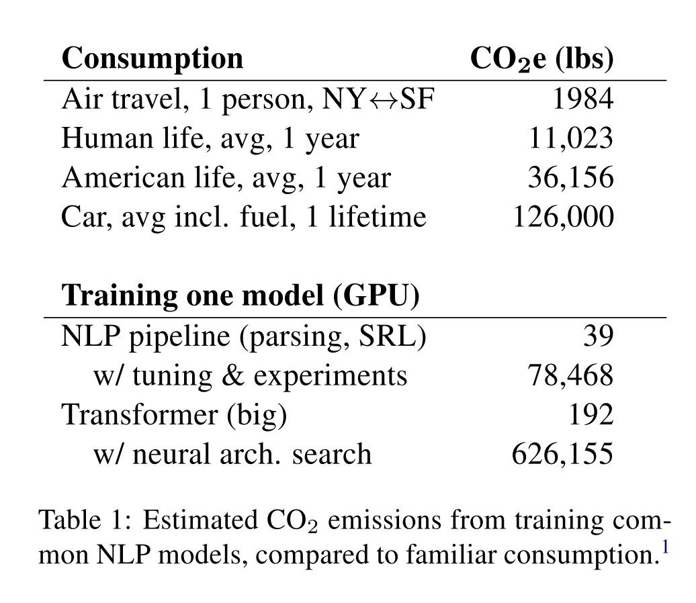

<!-- Copy this template to add a new topic. Replace text in {brackets} with your content. -->

# Energy demands of machine learning

## Summary of Issue: 

Machine learning has become a major tool and area of research in NIME, however in many forms it is extremely computationally intensive and uses large amounts of energy resources. This may contribute to a very large carbon footprint for ML-based research. 

## Questions Raised:

1. What is the carbon footprint for NIME-related machine learning tasks? 
2. Can green energy sources be used? What are they, and how can they be accessed by NIME researchers? 
3. How can researchers using machine learning optimize their work to reduce energy consumption and minimize emissions?

## Information and resources (TL;DR)

Researchers have estimated the carbon emissions for training one large data set to exceed that of 5 cars in their lifetimes [1]. To evaluate the potential environmental impact of a machine learning task, use the [Carbon Emissions Calculator](https://mlco2.github.io/impact/) developed by Lacoste, et al. [2]. Consider energy efficient alternatives for ML algorithms. When using cloud computing providers for rendering, look for those who actively use and promote renewable energy sources. 

-----

## Notes

Despite being inspired by the human brain, which is an incredibly energy-efficient system, the computation resources required for machine learning research have a surprisingly large carbon footprint. A paper [1] on energy demands of NLP (natural language processing) tasks showed that the energy used to train one complex data set emitted more CO2 than 5 gas-powered cars in their lifetimes (see Fig. below). Much of the high energy cost in their example was attributed to a late stage tuning step called neural architecture search (NAS), an automated trial and error process of designing the most optimized neural network. However, these exponentially energy intensive and time-consuming optimizations may add little performance benefit to an ML task and may not be necessary in many applications. 

In a more typical research scenario, the authors also point out that the full process of designing and evaluating an appropriate ML model is highly iterative, contributing to a high rate of energy consumption as well: a previous six-month study required training 4,789 models, amounting to emissions of 78,468 lbs. of CO2, roughly equivalent to 40 air flights.  

Another issue raised by [1] is the availability of adequate computational resources for researchers in academia. Trends in AI research favor ever larger datasets and complex ML pipelines, which may only be feasible for researchers in industry, potentially leading to privatization of the most cutting edge research. An alternative lies in utilizing cloud computing for rendering tasks, with paid services available from providers like Amazon and Google. While this may benefit academic researchers, it doesn't necessarily reduce energy demands and instead suggests the investigation of renewable energy sources used by the providers. See information about [Amazon Web Services](https://sustainability.aboutamazon.com/environment/the-cloud) and [Google Cloud](https://www.google.com/about/datacenters/efficiency/) with the provided links. Furthermore, researchers are urged to consider additional ethical aspects that may be associated with non-academic tools and resources. 

To address these issues, authors provide three recommendations: 

1. Authors should report training time and sensitivity to hyperparameters, to facilitate accurate cost-benefit analyses and comparisons. [2] proposes a number of standardized efficiency parameters that could be reported, including: carbon emission, electricity usage, elapsed real time, number of parameters, FPO (number of Floating Point Operations). 
2. Academic researchers need equitable access to computation resources. Where dedicated institutional resources are inadequate, cloud computing may be an option, however there are potential tradeoffs around sustainability (third party services commitment to renewable energy sources) and ethics (privacy, financial access)
3. Researchers should prioritize computationally efficient hardware and algorithms. While certain efficient algorithms exist, they may not be optimized for popular ML frameworks (such as TensorFlow or Pytorch), making them less accessible to non-ML-specialist researchers. 

Another important resource for evaluating the environmental impact of ML tasks is the [Carbon Emissions Calculator](https://mlco2.github.io/impact/) for researchers, created by Lacoste, et al. [3]. The tool can estimate emissions based on four factors of environmental impact: 

- location of server used for training
- energy grid used
- length of training procedure
- make and mode of hardware used

## External Links and References

- MIT Technology Review: [Training a single AI model can emit as much carbon as five cars in their lifetimes][MIT]
- Adobe XD Ideas: [Yes, AI Has a Carbon Footprint – So How Do We Deal With It?][adobe]
- The Outline: [How to train artificial intelligence that won’t destroy the environment][outline]
- The New Stack: [Check Your ML Carbon Footprint with the Machine Learning Emissions Calculator][newstack]

1. Strubell, E., Ganesh, A., & McCallum, A. (2019). Energy and Policy Considerations for Deep Learning in {NLP}. In Proceedings of the 57th Annual Meeting of the Association for Computational Linguistics (pp. 3645–3650). Florence, Italy: Association for Computational Linguistics. https://doi.org/10.18653/v1/P19-1355
2. Ai, G., Dodge, J., Smith, N. A., & Ai, R. (2019). Green AI. Retrieved from https://arxiv.org/abs/1907.10597
3. Lacoste, A., Luccioni, A., Schmidt, V., & Dandres, T. (2019). Quantifying the Carbon Emissions of Machine Learning. ArXiv Preprint. Retrieved from http://arxiv.org/abs/1910.09700

[MIT]: https://www.technologyreview.com/2019/06/06/239031/training-a-single-ai-model-can-emit-as-much-carbon-as-five-cars-in-their-lifetimes/
[adobe]: https://xd.adobe.com/ideas/principles/emerging-technology/ai-impact-on-climate-environment/
[outline]: https://theoutline.com/post/8186/artificial-intelligence-destroy-environment
[newstack]: https://thenewstack.io/check-your-ml-carbon-footprint-with-the-machine-learning-emissions-calculator/

----

## Contributor(s):

- [John Sullivan](mailto:johnny@johnnyvenom.com)